<div align="center">

# 🛡️ Security Angel

### A comprehensive mobile security ecosystem — for **Android** and **iOS**

*Protecting families and individuals from modern digital threats, powered by an actionable AI assistant that understands context, analyzes visual data, and proactively guards user privacy.*

<br/>

<p>
  
  
  
  
</p>

<p>
  
  
  
  
  
</p>

<sub>One Firebase backend · Byte-for-byte vault compatibility · Same Firestore schema across platforms</sub>

</div>

---

## Table of Contents

- [Feature Tour](#feature-tour)
- [Screenshots](#screenshots)
- [iOS Screenshots](#ios-screenshots)
- [Repository Layout](#repository-layout)
- [Architecture at a Glance](#architecture-at-a-glance)
- [Cross-Platform Parity](#cross-platform-parity)
- [Getting Started — Android](#getting-started--android)
- [Getting Started — iOS](#getting-started--ios)
- [Tech Stack](#tech-stack)
- [Author](#author)

---

## Feature Tour

### 🧠 AI Security Assistant — the brain

A Gemini-powered agent that lives inside the user's security context.

- **👁️ Computer vision & phishing detection.** Upload a screenshot of a suspicious SMS, email, or invoice. The model reads the image, extracts text, detects fake logos and urgent phrasing, and returns one of three verdicts: **SAFE · SUSPICIOUS · DANGEROUS**.
- **Context-aware (RAG).** Before each answer the app injects a live system context — leak count, family risk, recent scans, posture — so the assistant gives personalized advice (*"3 of your passwords were leaked recently, let's change them now"*) instead of generic chatbot platitudes.
- **🤖 Actionable AI (deep linking).** The assistant identifies user intent and emits `[ACTION:OPEN_VAULT]` / `[ACTION:GENERATE_PASSWORD]` / `[ACTION:CHECK_FAMILY]` tags. The app parses them and navigates directly to the relevant screen.

### 🔍 Smart Sandbox URL Scanner

A robust defense for analyzing links before clicking.

- **Aggregated analysis** via the **VirusTotal API** — queries the URL against **70+ antivirus engines** simultaneously.
- **Smart polling.** New / unknown URLs are auto-submitted for deep analysis on remote servers and polled in real time so the user never sees partial data.
- **Threat classification** — Malware, Phishing, or Adult Content — with clear warnings instead of raw scores.

### 👨‍👩‍👧‍👦 Real-Time Family Safety Net

A centralized dashboard for family heads and parents.

- **Risk monitoring.** Each family member gets a continuously calculated **Risk Score**. If a child's password leaks or they visit a malicious site, the admin sees it immediately.
- **Secure invitations.** Encrypted one-time invitation codes for joining a family group.
- **Admin-only activity log.** Snapshot listener on `security_logs` with a clear-all action.

### 🔐 Intelligent Password Vault

- **Leak detection** — vault entries are cross-referenced against the **Have I Been Pwned** database; leaked entries are flagged in the UI and persisted.
- **Strong generator** — configurable length and character classes, deep-linkable from the AI assistant.
- **Zero-knowledge crypto** — AES-256-GCM with PBKDF2-HMAC-SHA256 key derivation (100,000 iterations, 256-bit key, 12-byte IV, 16-byte tag). The same encrypted blob decrypts identically on Android and iOS.
- **Biometric unlock** — Face ID / fingerprint gates access to the in-memory PIN.

### 📱 Device Posture (iOS) / Permission Monitor (Android)

Continuously evaluates the device itself: jailbreak / root detection, passcode set, biometrics available, sandbox integrity, Lockdown Mode (iOS), and which apps hold sensitive permissions (Android).

---

## Screenshots

<table>
  <tr>
    <th align="center">AI Assistant 🧠</th>
    <th align="center">URL Scanner 🔍</th>
    <th align="center">Family Dashboard 👨‍👩‍👧‍👦</th>
    <th align="center">Password Generator ➕</th>
  </tr>
  <tr>
    <td align="center">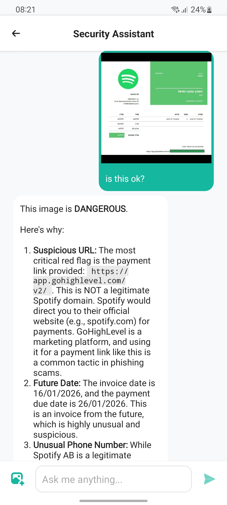</td>
    <td align="center">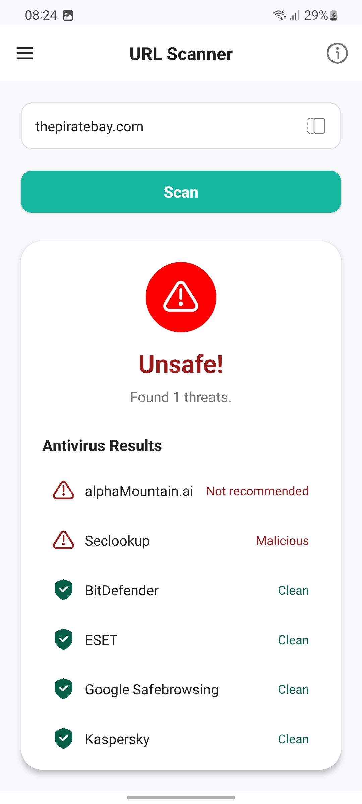</td>
    <td align="center">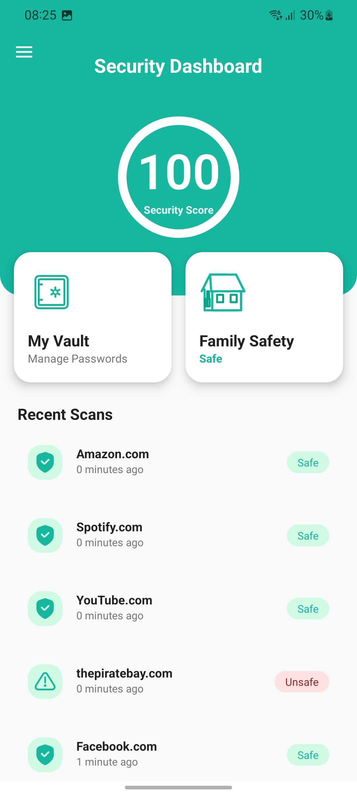</td>
    <td align="center">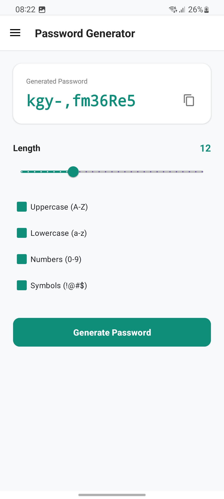</td>
  </tr>
  <tr>
    <td align="center"><sub><i>Visual analysis of suspicious content</i></sub></td>
    <td align="center"><sub><i>Real-time multi-engine scan</i></sub></td>
    <td align="center"><sub><i>Per-member risk monitoring</i></sub></td>
    <td align="center"><sub><i>Strong, configurable passwords</i></sub></td>
  </tr>
</table>

<details>
<summary><b>More screens →</b></summary>

<br/>

<table>
  <tr>
    <td align="center">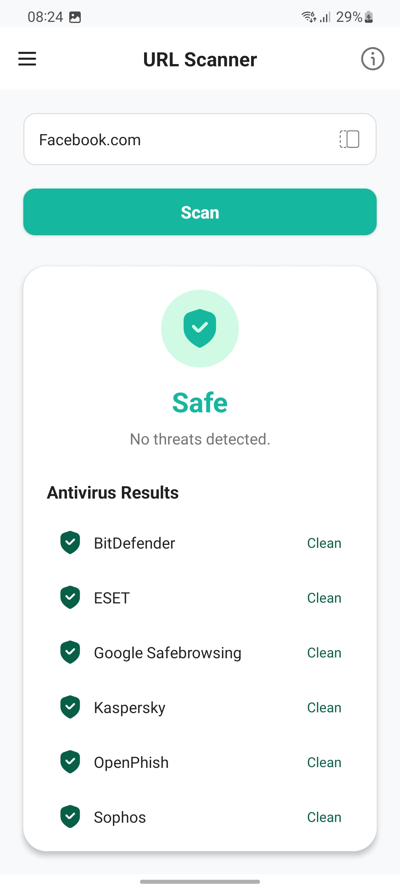</td>
    <td align="center">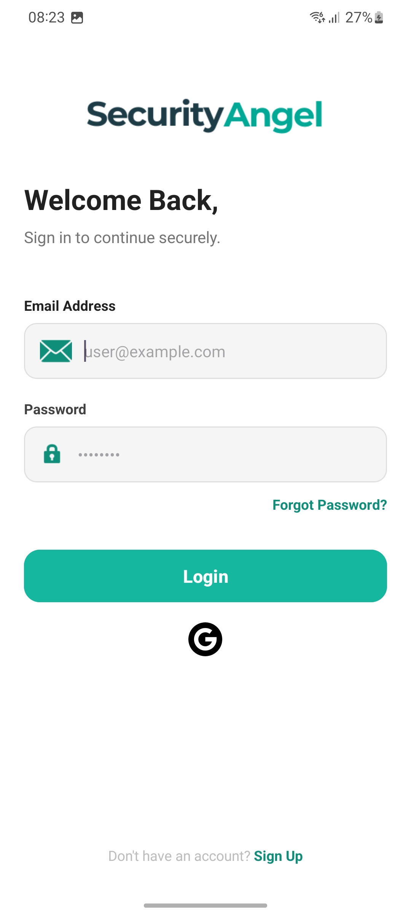</td>
    <td align="center">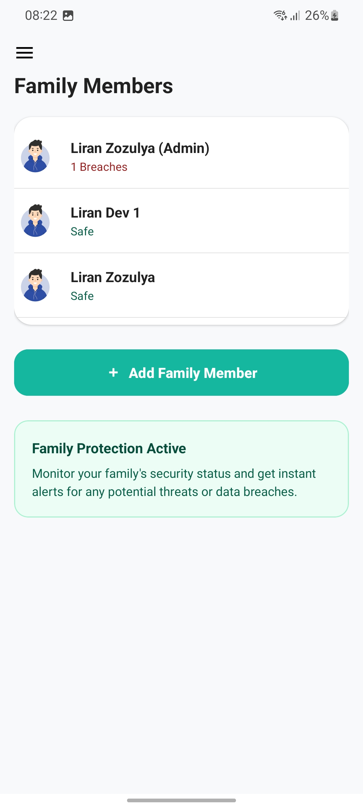</td>
    <td align="center">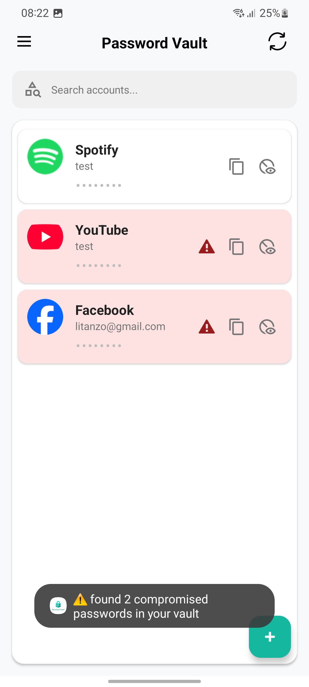</td>
  </tr>
</table>

</details>

---

## iOS Screenshots

Liquid-Glass SwiftUI port, captured on iPhone 17 Pro · iOS 26.

<table>
  <tr>
    <th align="center">Dashboard 🛡️</th>
    <th align="center">URL Scanner 🔍</th>
    <th align="center">AI Assistant 🧠</th>
    <th align="center">Password Generator ➕</th>
  </tr>
  <tr>
    <td align="center">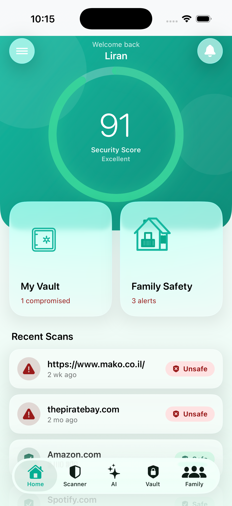</td>
    <td align="center">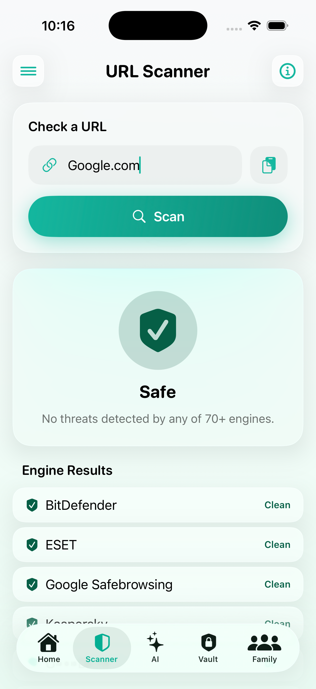</td>
    <td align="center">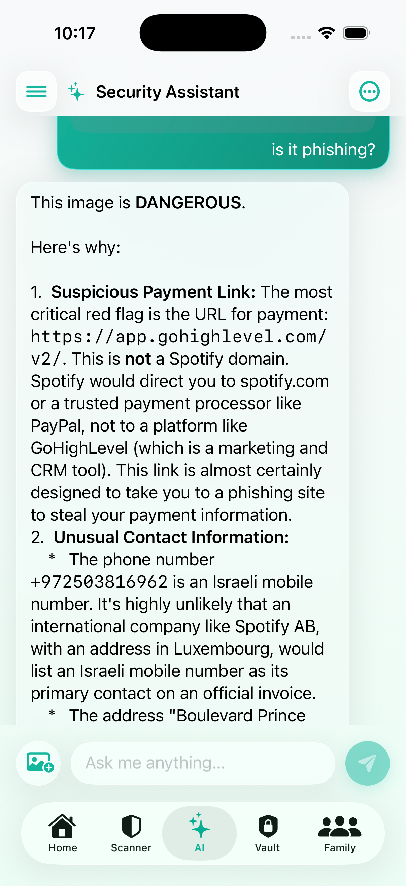</td>
    <td align="center">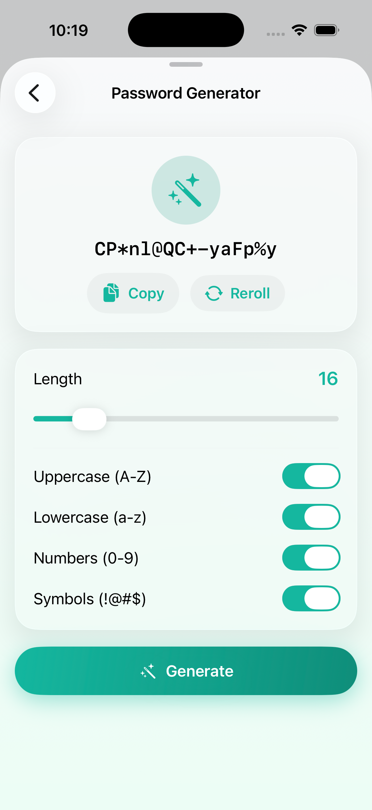</td>
  </tr>
  <tr>
    <td align="center"><sub><i>Animated score · family alerts · recent scans</i></sub></td>
    <td align="center"><sub><i>Live 70-engine VirusTotal verdict</i></sub></td>
    <td align="center"><sub><i>Multimodal phishing analysis</i></sub></td>
    <td align="center"><sub><i>Configurable strong-password generator</i></sub></td>
  </tr>
</table>

---

## Repository Layout

This is a **monorepo** containing the full Security Angel product for both mobile platforms, plus the shared documentation.

```
.
├── README.md                ← you are here
├── SecurityAngel/           ← Android app  (Kotlin · Android Studio)
│   ├── app/                 — main module (UI, services, AI, vault)
│   ├── screenshots/         — marketing screenshots used above
│   ├── build.gradle.kts
│   └── settings.gradle.kts
└── SecurityAngelIOS/        ← iOS app    (Swift · SwiftUI · Xcode 26+)
    ├── SecurityAngelIOS/    — main target (Features/, Services/, Crypto/, …)
    ├── SecurityAngelAutoFill/ — AutoFill Credential Provider extension
    └── SecurityAngelIOS.xcodeproj
```

History from both original repositories is preserved via `git subtree` — each commit on either platform appears in this repo's log under its respective prefix.

---

## Architecture at a Glance

Both apps share the same backend and the same data model.

```
            ┌────────────────────────────────────────────────────┐
            │                Firebase (shared)                   │
            │                                                    │
            │   Auth   ·   Firestore   ·   Cloud Storage         │
            └─────┬──────────────────────────────────────┬───────┘
                  │                                      │
   ┌──────────────┴───────────┐         ┌────────────────┴──────────────┐
   │       Android (Kotlin)   │         │        iOS (SwiftUI)          │
   │                          │         │                               │
   │  • MVVM + Coroutines     │         │  • @Observable + async/await  │
   │  • Retrofit + OkHttp     │         │  • URLSession                 │
   │  • CredentialManager     │         │  • ASCredentialProvider ext.  │
   │  • Glide / Lottie        │         │  • LiquidGlass DesignSystem   │
   └──────────┬───────────────┘         └───────────────┬───────────────┘
              │                                         │
              └────────────┬────────────────────────────┘
                           ▼
              External services (shared)
              VirusTotal · HaveIBeenPwned · Gemini (Vision + Text)
```

---

## Cross-Platform Parity

| | **Android** | **iOS** |
|---|---|---|
| Language | Kotlin | Swift |
| UI | XML + ViewBinding | SwiftUI (Liquid Glass on iOS 26+) |
| Min OS | Android 9 (API 28) | iOS 18 |
| Auth | Firebase Auth | Firebase Auth |
| Vault crypto | AES-256-GCM · PBKDF2-HMAC-SHA256 · 100k iters | **Identical bytes** |
| AI model | Gemini (Vision + Text) | Same prompt format, same `[ACTION:…]` parser |
| Scanner | VirusTotal v3 + smart polling | VirusTotal v3 + smart polling |
| Family / vault / scans schema | `users/{uid}/…` | **Same documents** |
| AutoFill | Android `CredentialManager` provider | `ASCredentialProviderViewController` extension |
| Device safety | Root + permission monitor | Jailbreak + posture (passcode, biometrics, Lockdown, sandbox) |

> ✅ Sign in with an Android account on iOS (or vice versa) — same `users/{uid}` doc, same family, same vault, same scan history.

---

## Getting Started — Android

**Requirements:** Android Studio Iguana+, JDK 17, Android SDK 34, a device or emulator on API 28+.

1. **Clone the monorepo and open the Android project.**

   ```bash
   git clone https://github.com/liranzoz/SecurityAngel.git
   cd SecurityAngel/SecurityAngel        # open this folder in Android Studio
   ```

2. **Firebase setup.** Drop your `google-services.json` into `SecurityAngel/app/`.

3. **API keys.** Create `SecurityAngel/local.properties` (gitignored) with:

   ```properties
   GEMINI_API_KEY=your_gemini_key_here
   VIRUSTOTAL_API_KEY=your_virustotal_key_here
   SECRET_KEY=your_local_secret_key
   ```

4. **Build & run** — `▶︎ Run 'app'` from Android Studio.

---

## Getting Started — iOS

**Requirements:** Xcode 26+, iOS 18 deployment target (Liquid Glass renders natively on iOS 26+; older iOS falls back to `.regularMaterial`).

1. **Clone the monorepo and open the iOS project.**

   ```bash
   git clone https://github.com/liranzoz/SecurityAngel.git
   cd SecurityAngel/SecurityAngelIOS
   open SecurityAngelIOS.xcodeproj
   ```

2. **Firebase setup.** Download `GoogleService-Info.plist` from the Firebase console (iOS app, bundle id `com.zoz.SecurityAngelIOS`) and drop it into `SecurityAngelIOS/SecurityAngelIOS/` (next to the `App/` folder). Add it to the SecurityAngelIOS target.

3. **API keys.** `Secrets.swift` reads from environment variables. In Xcode: **Product → Scheme → Edit Scheme… → Run → Arguments → Environment Variables**:

   | Name | Value |
   |---|---|
   | `GEMINI_API_KEY` | your Gemini key |
   | `VIRUSTOTAL_API_KEY` | your VirusTotal key |

4. **Build & run** — `⌘R`. Sign up (email verification required, same as Android) or sign in with an existing Firestore account.

### AutoFill extension

The build produces a second target, `SecurityAngelAutoFill`, embedded as a Credential Provider extension. The code is complete, but Apple gates the `com.apple.developer.authentication-services.autofill-credential-provider` entitlement behind a **paid Apple Developer Program membership** ($99/yr). With "Sign to Run Locally" the build still succeeds — the extension just won't appear in the AutoFill picker.

To enable AutoFill:

1. Enroll in the [Apple Developer Program](https://developer.apple.com/programs/).
2. Select **both** the `SecurityAngelIOS` and `SecurityAngelAutoFill` targets in Xcode → **Signing & Capabilities** → choose your team.
3. Add **AutoFill Credential Provider** capability on the `SecurityAngelAutoFill` target.
4. Build, run, then on the device/simulator go to **Settings → General → AutoFill & Passwords → AutoFill From** → toggle on **Security Angel**.

---

## Tech Stack

<table>
<tr>
<td valign="top" width="50%">

**Android**

- Kotlin · Android Studio
- Firebase Auth · Firestore · Storage
- Retrofit 2 · OkHttp
- Glide · Lottie
- `CredentialManager` (passkey + password AutoFill)
- ViewBinding · Coroutines · Flows

</td>
<td valign="top" width="50%">

**iOS**

- Swift · SwiftUI · Xcode 26
- Firebase Auth · Firestore (iOS SDK)
- URLSession + async/await
- Liquid Glass design system (custom `GlassCard`, `ScoreRing`, `StatusPill`)
- `ASCredentialProviderViewController` extension
- CryptoKit (AES-GCM, PBKDF2 via CommonCrypto)
- Keychain Access Group for cross-target session sharing

</td>
</tr>
<tr>
<td colspan="2" valign="top">

**Shared services**

- **Gemini** — Vision + Text, custom `SYSTEM_CONTEXT` prompt block, `[ACTION:CODE]` parser for deep linking
- **VirusTotal v3** — submit / poll / aggregate across 70+ engines
- **Have I Been Pwned** — k-anonymity password leak check
- **Firebase** — single project, identical Firestore schema, identical security rules

</td>
</tr>
</table>

---

## Author

Built and maintained by **Liran Zozulya**.

> If you spot a bug or have a suggestion, please open an issue — feedback is welcome.

<div align="center">
<sub>© Security Angel · Made with ☕ and a healthy distrust of suspicious URLs.</sub>
</div>
